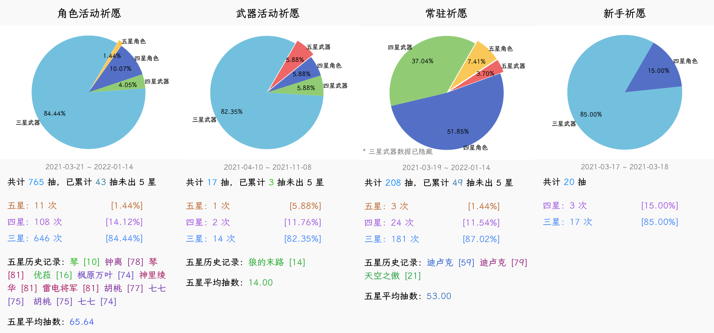
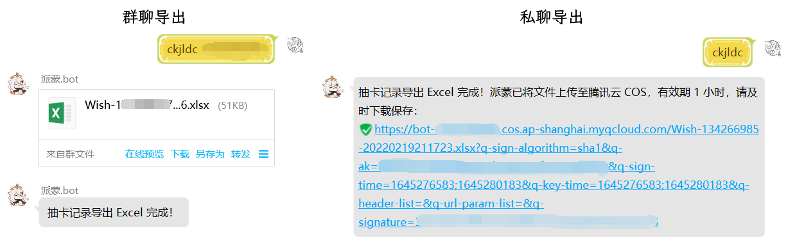

<h1 align="center">Nonebot Plugin GachaLogs</h1></br>


<p align="center">🤖 用于统计及导出原神祈愿记录的 Nonebot2 插件</p></br>


<p align="center">现已支持抽卡记录链接自动更新！</p></br>


<p align="center">
  <a href="https://github.com/monsterxcn/nonebot-plugin-gachalogs/actions">
    
  </a>
  <a href="https://raw.githubusercontent.com/monsterxcn/nonebot-plugin-gachalogs/master/LICENSE">
    
  </a>
  <a href="https://pypi.python.org/pypi/nonebot-plugin-gachalogs">
    
  </a>
  <br />
</p></br>


**安装方法**


如果你正在使用 2.0.0.beta1 以上版本 NoneBot，推荐使用以下命令安装插件本体：


```bash
# 从 nb_cli 安装
python3 -m nb plugins install nonebot-plugin-gachalogs

# 或从 PyPI 安装
python3 -m pip install nonebot-plugin-gachalogs
```


<details><summary><i>在 NoneBot 2.0.0.alpha16 上使用此插件</i></summary></br>


在过时的 NoneBot 2.0.0.alpha16 可能仍有机会体验此插件！不过，千万不要通过 NoneBot 脚手架或 PyPI 安装，你只能通过 Git 手动安装。以下命令仅作参考：


```bash
# 进入 Bot 根目录
cd /path/to/bot
# 安装依赖
# source venv/bin/activate
python3 -m pip install matplotlib Pillow xlsxwriter
# 安装插件
git clone https://github.com/monsterxcn/nonebot-plugin-gachalogs.git
cd nonebot_plugin_gachalogs
cp -r nonebot_plugin_gachalogs /path/to/bot/plugins/
cp -r data/gachalogs /path/to/bot/data/
```


</details>


一般来说，无需设置环境变量，只需重启 Bot 即可直接开始使用此插件。如果需要，你也可以在 Nonebot2 当前使用的 `.env` 文件中，参考 [.env.example](.env.example) 添加这些环境变量：


 - `gachalogs_safe_group` 安全群组，只有在安全群组内才允许输入链接、Cookie 等内容
 - `gacha_expire_sec` 祈愿历史记录本地缓存过期秒数，不设置默认 1 小时
 - `resources_dir` 包含 `gachalogs` 文件夹的上级目录路径，不设置默认 Bot 根目录下 `data` 文件夹
 - `gachalogs_font` 抽卡记录绘制使用字体，不设置默认为 `LXGW-Bold.ttf`
 - `gachalogs_pie_font` 抽卡记录饼图绘制使用字体，不设置默认为 `LXGW-Bold-minipie.ttf`


\* *私聊导出文件需要 go-cqhttp 支持 [相关接口](https://docs.go-cqhttp.org/api/#%E4%B8%8A%E4%BC%A0%E7%A7%81%E8%81%8A%E6%96%87%E4%BB%B6)*


重启 Bot 即可体验此插件。


**使用方法**


插件支持以下命令：


 - `抽卡记录` / `ckjl`
   
   返回一张统计饼图，样式与 https://genshin.voderl.cn/ 一致。附带 `-f` / `--force` 可要求强制获取最新祈愿记录，祈愿记录结果默认缓存 1 小时。
   
   初次使用要求输入一次祈愿历史记录链接或米游社通行证 Cookie。如果初次使用输入链接（只要回复的内容中含有即可，不必手动截取准确的链接地址），在该链接的 AuthKey 过期后需要重新输入链接或 Cookie 才能刷新数据。如果初次使用输入 Cookie，只要 Cookie 有效，后续使用时抽卡记录链接将自动更新，无需再次输入。
   
   注意，Cookie 需要登陆 [米游社通行证](https://user.mihoyo.com/#/login/) 获取，而非 [米游社 BBS](https://bbs.mihoyo.com/)，其中需要包含 `stoken` `stuid` 或 `login_ticket`。
   
   
   
 - `抽卡记录导出` / `ckjldc`
   
   导出祈愿历史记录，默认导出为表格，可选格式包括 `excel` 表格、`json` 文件、`url` 链接等。此命令还可以附带 `cookie` 来导出当前绑定的米游社 Cookie，你可能在一些地方需要用到它。管理员可使用 `ckjldc [@某人] [格式]` 形式的命令导出指定 QQ 的祈愿历史记录。
   
   导出表格与 JSON 文件均符合 [统一可交换祈愿记录标准](https://github.com/DGP-Studio/Snap.Genshin/wiki/StandardFormat)（UIGF）格式，你可以尝试在其他支持此标准的工具中导入。导出链接可以在某些工具中使用。
   
   在不安全群组中使用此命令，Bot 会尝试通过私聊发送文件，如果未添加 Bot 为好友将无法发送导出内容。在环境变量中添加安全群组以允许群聊导出，如果大家并不在意安全隐患的话。插件已不再使用下图中的私聊发送文件方式，而是通过 go-cqhttp 提供的接口。
   
   
   
 - `抽卡记录删除` / `ckjlsc`
   
   删除本地缓存的抽卡记录，不带参数默认删除自己的记录，可通过手动输入 QQ 号或 @某人 的方式指定操作用户。非 Bot 管理员只能删除自己的记录。删除记录不会影响 Cookie 配置等内容。
   
   记录一旦删除将无法恢复，所以此命令会要求重新发送附带 `-f` 的命令以确认操作。你也可以在第一次发送命令时就附带 `-f` 直接确认操作。


**特别鸣谢**


[@nonebot/nonebot2](https://github.com/nonebot/nonebot2/) | [@Mrs4s/go-cqhttp](https://github.com/Mrs4s/go-cqhttp) | [@sunfkny/genshin-gacha-export](https://github.com/sunfkny/genshin-gacha-export) | [@voderl/genshin-gacha-analyzer](https://github.com/voderl/genshin-gacha-analyzer)


> 插件主要功能是从 [@sunfkny/genshin-gacha-export](https://github.com/sunfkny/genshin-gacha-export) 抄的，溜溜…
