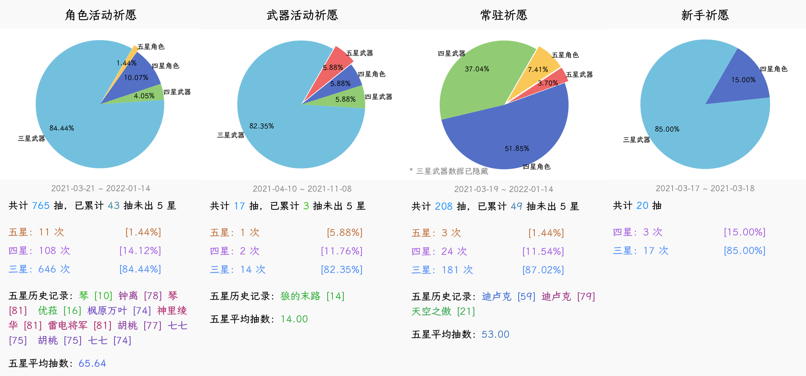

<h1 align="center">Nonebot Plugin GachaLogs</h1></br>


<p align="center">🤖 用于统计及导出原神祈愿记录的 Nonebot2 插件</p></br>


<p align="center">
  <a href="https://github.com/monsterxcn/nonebot-plugin-gachalogs/actions">
    
  </a>
  <a href="https://raw.githubusercontent.com/monsterxcn/nonebot-plugin-gachalogs/master/LICENSE">
    
  </a>
  <a href="https://pypi.python.org/pypi/nonebot-plugin-gachalogs">
    
  </a>
  <br />
</p></br>


**安装方法**


使用以下命令安装插件本体 ~~（插件暂未发布于 PyPI）~~：


```bash
# 从 Git 安装
git clone https://github.com/monsterxcn/nonebot-plugin-gachalogs.git
cd nonebot_plugin_gachalogs
cp -r nonebot_plugin_gachalogs /path/to/nonebot/plugins/
cp -r resources/gachalogs /path/to/resources/
```


然后检查一下，别忘了安装依赖 `matplotlib` `Pillow` `xlsxwriter`！


```bash
python3 -m pip install matplotlib Pillow xlsxwriter
```


<details><summary><i>从 PyPI 安装</i></summary></br>


```bash
# 从 PyPI 安装
python3 -m pip install nonebot-plugin-gachalogs
```


从 PyPI 安装后需要手动将 `resources/gachalogs` 文件夹内资源下载到服务端。


</details>


打开 Nonebot2 正在使用的 `.env` 文件，参考 [.env.example](.env.example) 添加以下配置：


 - `resources_dir` 包含 `gachalogs` 文件夹的上级目录路径
 - `gacha_expire_sec` 祈愿历史记录本地缓存过期秒数，不设置默认 1 小时
 - `cos_bucket_name` 腾讯云 COS 存储桶名称
 - `cos_bucket_region` 腾讯云 COS 存储桶地域
 - `cos_secret_id` 腾讯云 COS 存储桶 SecretId
 - `cos_secret_key` 腾讯云 COS 存储桶 SecretKey


\* *关于腾讯云 COS 的配置仅用于私聊导出文件*


重启 Bot 即可体验此插件。


**使用方法**


插件支持以下命令：


 - `抽卡记录` / `ckjl`
   
   返回一张统计饼图，样式与 https://genshin.voderl.cn/ 一致。
   
   初次使用要求输入一次祈愿历史记录链接，只要回复的内容中含有即可，不必手动截取准确的链接地址。
   
   附带 `-f` / `--force` 可要求强制获取最新祈愿记录，祈愿记录结果默认缓存 1 小时。
   
   
   
 - `抽卡记录导出` / `ckjldc`
   
   导出祈愿历史记录文件，可选格式包括 `.xlsx` 表格和 `.json` 文件，均符合 [统一可交换祈愿记录标准](https://github.com/DGP-Studio/Snap.Genshin/wiki/StandardFormat)（UIGF）格式。
   
   附带 `j` / `json` / `u` / `uigf` 可指定导出 `.json` 文件，否则默认导出 `.xlsx` 表格。
   
   管理员可使用 `ckjldc [qq] [format]` 格式命令导出指定 QQ 的祈愿历史记录。
   
   此功能需要配置腾讯云 COS 以实现私聊文件发送，创建的存储桶建议设为私有读写。
   
   


**特别鸣谢**


[@nonebot/nonebot2](https://github.com/nonebot/nonebot2/) | [@Mrs4s/go-cqhttp](https://github.com/Mrs4s/go-cqhttp) | [@sunfkny/genshin-gacha-export](https://github.com/sunfkny/genshin-gacha-export) | [@voderl/genshin-gacha-analyzer](https://github.com/voderl/genshin-gacha-analyzer)


> 插件主要功能是从 [@sunfkny/genshin-gacha-export](https://github.com/sunfkny/genshin-gacha-export) 抄的，溜溜…
